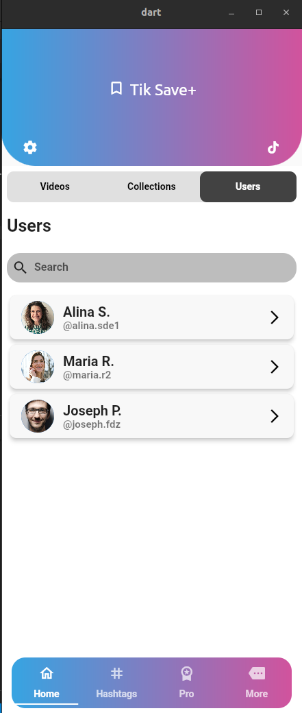
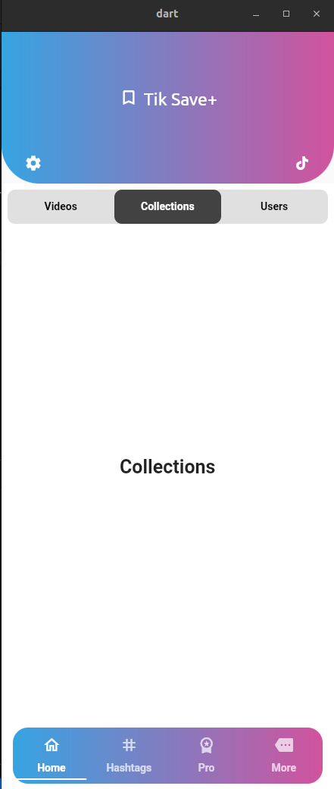
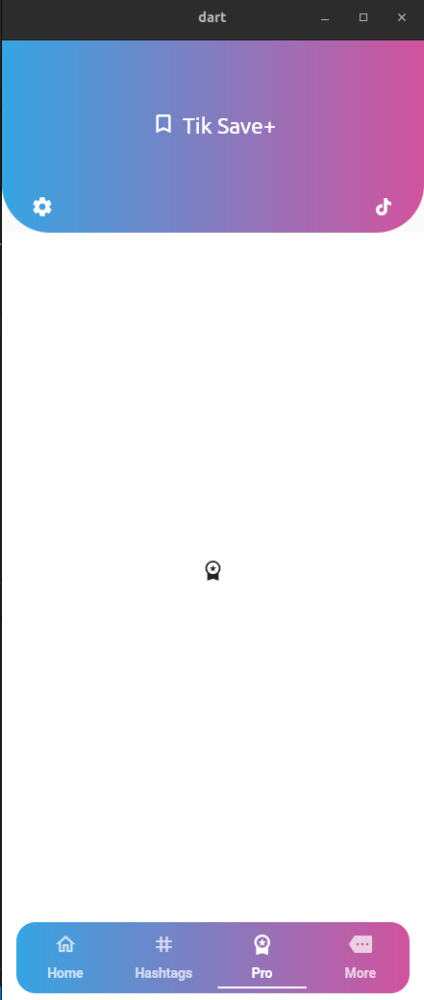

# StackOverFlow UI

This is the UI which someone asked in StackOverFlow that how it can be designed. I tried my best to design the way he wants.

Star ⭐ this repo if you like it.

Images are from [Pexel](https://www.pexels.com/)

## ✨ Requirements

- Any Operating System (ie. MacOS X, Linux, Windows)
- Any IDE with Flutter SDK installed (ie. IntelliJ, Android Studio, VSCode etc)
- A little knowledge of Dart and Flutter
- A brain to think 🤓🤓
- A little bit of patience if your system specifications are low 🙃

## StackOverFlow Question

- [Here is the question](https://stackoverflow.com/questions/73325931/how-to-make-this-tab-bar-in-flutter/73332122#73332122)

## 📸 ScreenShots

## 📱 Connect with me

- [Github](https://github.com/Munsif-Ali)
- [LinkedIn](https://www.linkedin.com/in/munsif-ali)
- [Twitter](https://twitter.com/Munsif_Ali_Taj)
- [Instagram](https://www.instagram.com/munsif_ali_taj/)

## 📝 Want To Learn To Flutter?

- [Flutter Web](https://docs.flutter.dev/) - Recommended for Official Documentation.

- [The Complete 2021 Flutter Development Bootcamp with Dart](https://www.udemy.com/course/flutter-bootcamp-with-dart/) - Paid One of the best course by [Dr Agela](https://twitter.com/yu_angela).

- [Free Flutter Course 💙](https://www.youtube.com/playlist?list=PL6yRaaP0WPkVtoeNIGqILtRAgd3h2CNpT) - Free Best and in depth course(more than 30 hours content) uptill now on youtube for free and with full state managment course in flutter by [Opens profile photo Vandad Nahavandipoor](https://mobile.twitter.com/vandadnp).
